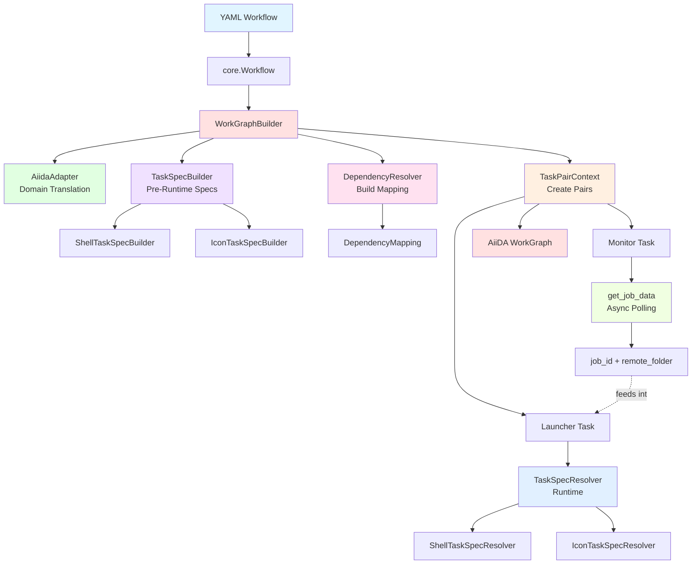
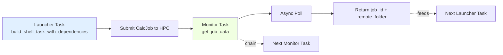
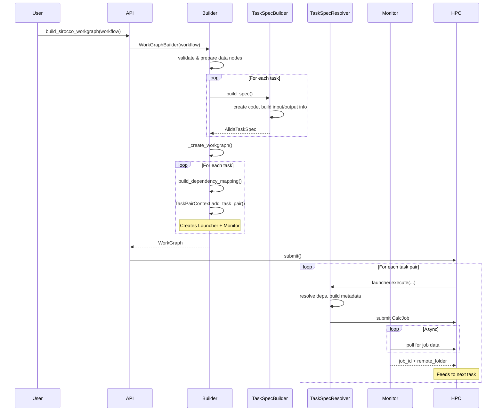

# AiiDA Engine Architecture

## Summary

This document describes the architecture of Sirocco's AiiDA-based execution engine, which translates Sirocco workflows into WorkGraph structures for submission with AiiDA. The engine handles dependency resolution, SLURM job chaining, and rolling window execution.

This design was introduced in the [WorkGraph PR](https://github.com/C2SM/Sirocco/pull/TBD) and implements a complete execution engine that bridges Sirocco's domain model with AiiDA's workflow infrastructure.

## Architecture



## Module Structure

The engine is organized into modules by execution phase and responsibility:

```
src/sirocco/engines/aiida/
├── execute.py                      Public API
├── builder.py                      Top-level WorkGraph builder
├── adapter.py                      Core ↔ AiiDA translation
├── spec_builders.py                Pre-runtime spec building
├── spec_resolvers.py               Runtime spec resolution
├── task_pairs.py                   WG task pair creation
├── monitoring.py                   Job monitoring for pre-submission
├── dependency_resolvers.py         Runtime dependency resolution
├── calcjob_builders.py             CalcJob input builders (for IconCalculation)
├── models.py                       AiiDA-specific data models
├── types.py                        Type aliases, Protocols & TypedDicts
├── code_factory.py                 AiiDA Code creation
├── utils.py                        AiiDA-specific helper utilities
├── topology.py                     Topological level computation
└── patches/
    ├── firecrest_symlink.py        Handle dangling symlinks in pre-submission (aiida-firecrest)
    ├── slurm_dependencies.py       Handle SLURM dependency race conditions (aiida-core)
    └── workgraph_window.py         Rolling window submission control (aiida-workgraph)
```

## Core Design

### Two-Phase Execution Model

**Phase 1: Pre-Runtime (Spec Building)**
```python
# Build immutable, serializable specifications
ShellTaskSpecBuilder(task).build_spec()
└─> AiidaShellTaskSpec (Pydantic model with code_pk, metadata, arguments_template, ...)
```

**Phase 2: Runtime (Execution)**
```python
# Execute with runtime dependencies
ShellTaskSpecResolver(spec).execute(input_data_nodes, task_folders, task_job_ids)
└─> Load code → Resolve deps → Build metadata → Add to WorkGraph
```

### Launcher + Monitor Task Pairs

Each Sirocco task becomes **two** WorkGraph tasks:



**Why?**
- **Separation**: Launcher handles submission, Monitor tracks completion
- **Chaining**: Monitors chain serially (`monitor_a >> monitor_b`)
- **Data flow**: `remote_folder` → `task_folders`, `job_id` → `task_job_ids`

### Dependency Resolution

**Pre-Runtime: Build Mapping**
```python
build_dependency_mapping(task, workflow) -> DependencyMapping
├─ port_mapping: {port_name: [DependencyInfo(dep_label, filename, data_label)]}
├─ task_folders: {dep_label: remote_folder_socket}
└─ task_job_ids: {dep_label: job_id_socket}
```

**Runtime: Resolve to Nodes**

Shell tasks:
```python
resolve_shell_dependency_mappings(task_folders, port_dependencies)
└─> ShellDependencyMappings(nodes, placeholders, filenames)
```

ICON tasks:
```python
resolve_icon_dependency_mapping(task_folders, port_dependencies, namelists)
└─> {port_name: RemoteData}  # Includes restart file resolution
```

### Rolling Window Execution

Controls submission for large workflows. Configuration is read from `workflow.front_depth` (set in YAML config):

```python
window_config = {
    "enabled": True,
    "front_depth": 2,  # Max active topological levels (from workflow.front_depth)
    "task_dependencies": {...}
}
```

- `front_depth=1`: Sequential (one level at a time)
- `front_depth=2`: Moderate parallelism (2 levels active)
- Higher: More aggressive pre-submission

## Data Models

Models to encapsulate AiiDA-specific data structures, keeping the core domain model engine-agnostic:

**Why separate models?**
- **Separation of concerns**: Core domain models (in `sirocco.core`) contain no business logic or AiiDA-specific data
- **Engine abstraction**: Different execution engines can define their own models or DTOs
- **Type safety**: Pydantic models provide validation and serialization for WorkGraph
- **Immutability**: Specs are built once and remain immutable during execution

**Key model categories:**

1. **Task Specifications** (`AiidaShellTaskSpec`, `AiidaIconTaskSpec`)
   - Pre-built, serializable specifications containing code PKs, metadata, arguments templates
   - Store everything needed for runtime execution (no re-computation)

2. **Dependency Models** (`DependencyInfo`, `DependencyMapping`, `ShellDependencyMappings`)
   - Map task dependencies to AiiDA RemoteData nodes and SLURM job IDs
   - Bridge core workflow structure to AiiDA execution graph
   - `ShellDependencyMappings`: Dataclass grouping nodes, placeholders, and filenames for shell tasks

3. **Metadata Models** (`AiidaMetadata`, `AiidaMetadataOptions`, `AiidaResources`)
   - Translate HPC configuration (cores, walltime, queue) to AiiDA scheduler options
   - Handle computer assignments and custom scheduler directives

4. **Data Info Models** (`InputDataInfo`, `OutputDataInfo`)
   - Track metadata about input/output files (paths, labels, ports, coordinates)
   - Enable proper file staging and output retrieval

5. **Serialized TypedDicts** (in `types.py`)
   - `SerializedInputDataInfo`, `SerializedOutputDataInfo`, `SerializedDependencyInfo`
   - Define the shape of serialized data passed through WorkGraph
   - Imported outside `TYPE_CHECKING` in models.py for Pydantic runtime validation

## Complete Data Flow



## Design Decisions

### Decision 1: Two-Phase Execution (Spec Building vs Runtime)

**Context**: WorkGraph tasks need to be serializable and pass through AiiDA's provenance system.

**Decision**: Split task creation into two phases:
1. Pre-runtime: Build immutable specs with all static configuration
2. Runtime: Resolve dependencies and execute with dynamic inputs

**Rationale**:
- Spec building can happen once upfront and be reused
- Runtime resolution happens within WorkGraph's execution context
- Clear separation between static configuration and dynamic execution

**Alternatives considered**:
- Single-phase: Would require re-computing specs during execution
- Direct WorkGraph API: Would couple Sirocco tightly to WorkGraph

### Decision 2: Launcher + Monitor Task Pairs

**Context**: Need SLURM job IDs for dependency chaining while jobs are still running.

**Decision**: Create two tasks per Sirocco task:
- Launcher: Submits the CalcJob
- Monitor: Polls for job_id and remote_folder asynchronously

**Rationale**:
- Decouples submission from completion tracking
- Enables pre-submission workflows (SLURM dependencies)
- Allows rolling window control via monitor chaining

**Alternatives considered**:
- Single task: Can't get job_id until completion
- Direct AiiDA queries: Would bypass WorkGraph's dependency tracking

### Decision 3: Adapter Pattern for Domain Translation

**Context**: Core domain models should remain engine-agnostic.

**Decision**: Create `AiidaAdapter` class with static methods for all core → AiiDA translations.

**Rationale**:
- Keeps core domain clean of execution-engine concerns
- Centralizes all translation logic
- Makes it easier to support multiple engines

**Alternatives considered**:
- Methods on core classes: Would pollute core with engine-specific logic
- Free functions: Less organized, harder to test

### Decision 4: Pydantic Models for Task Specs

**Context**: Task specifications need validation and must be serializable for WorkGraph.

**Decision**: Use Pydantic models for all task specifications and metadata.

**Rationale**:
- Built-in validation ensures correctness
- Automatic serialization/deserialization
- Type safety and IDE support
- Immutability via frozen models

**Alternatives considered**:
- TypedDicts: No validation, mutable
- Dataclasses: No validation, harder to serialize
- Plain dicts: No type safety or validation

## Implementation Notes

### Logger Naming Convention

All modules use lowercase `logger` for consistency with Python conventions:
```python
logger = logging.getLogger(__name__)
```

### Public API Marking

Modules use `__all__` declarations to mark public vs internal API:
```python
__all__ = ["WorkGraphBuilder", "build_sirocco_workgraph"]
```

This follows the pattern of established packages (NumPy, pandas, Flask) - everything remains accessible for development, but the official API is clearly marked.

## Remaining TODOs (within this PR)

- [x] Add engine field to `config.yml`
- [x] Templating should output config file with jinja2 template variables replaced
- [x] Align `front_depth` meaning (has to be strictly positive integer -> 1 == what I used to call __sequential__ - no pre-submission)
- [x] Possibly, cleanup files?
- [x] Verify tests
- [ ] Align tests/cases config files

## Remaining TODOs (after this PR)

- [ ] CLI changes (already issue exists for that)
    - Make CLI work with both engines (currently commands either AiiDA or standalone specific)
        - Properly have import checks, if-else, depending on the engine selection
        - For now, just merge without refactoring; otherwise, commands might break for both
    - Drop hard-coding of `vars.yml`, but expose `template_file.yml` (or similar) to the user
    - (possibly) instead of exposing the `workflow_file`, instead point to `config_directory` (config dir is one entity, e.g., zip it and share with others)
- [ ] Make sure tests cases work with `standalone` (@leclairm)
- [ ] Align ShellTask Code creation / command selection
    - We use `uenv` via `uenv run`, not via SLURM header, to allow for multiple `uenv`s being used in one run
    - Probably we can `bash` everything, always prepend `bash`
    - Use existence of `path: ` also to verify that. If `path` not given -> we don't have to copy anything.

## Top-level list of features

- full refactor of `workgraph.py` to enable SLURM pre-submission with dynamic windowing (using a functional approach)

__scope creeps__

- simple and complex dummy workflows with shell scripts that actually do arithmetic, such that workflow runs can be validated (i.e., branch independence, waiting, execution order, etc.)
- jinja2-templating in `config.yml` files (template values are given via `vars.yml`; running test cases as examples via `run.sh` scripts)
- patches:
  - to handle slurm job dependency errors in aiida-core
  - dynamic window recomputation in aiida-workgraph
  - symlinking with missing targets via aiida-firecrest

__WIP__
- DYAMOND workflow with aiida engine added to tests cases

__previously noted TODOs__
- [x] Fix `get_job_data`: no QB, but pass WG pk directly -> this does not work, as the WG does not exist at this stage yet, only its future label, hence the QB is necessary
- [x] Rolling task front
- [x] Fix `verdi process dump` for Sirocco WG (has to be done in aiida-core ... TODO: add as patch)
- [ ] A bit simpler `large` workflow (real ICON, can be sleep for pre- and post-proc)
- [ ] `next` and `previous` symlinks for symlink tree on HPC
