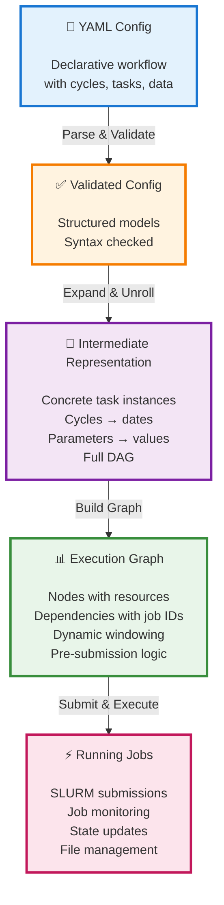

# Sirocco Execution Flow Architecture

## Overview

Sirocco transforms declarative YAML workflow definitions into executable HPC job orchestrations through a multi-stage pipeline involving validation, intermediate representation, and execution planning.

This document describes the complete execution flow from YAML configuration to running SLURM jobs.

## Simple Data Flow Diagram



---

## Detailed Stage Breakdown

### Stage 1: YAML Config File → Validated Config

**Module:** `sirocco.parsing.yaml_data_models`

**Input:** User-written workflow specification

```yaml
cycles:
  - monthly:
      cycling:
        start_date: '2025-01-01'
        stop_date: '2025-03-01'
        period: 'P1M'
      tasks:
        - preprocess:
            inputs: [obs_data]
            outputs: [processed_data]
```

**Key Classes:**
- `ConfigWorkflow`: Top-level workflow container
- `ConfigCycle`: Cycle definition with cycling rules
- `ConfigTask`: Task specification (plugin, resources, command)
- `ConfigData`: Available and generated data definitions

**What Happens:**
- ✅ Syntax validation (required fields, types)
- ✅ Semantic validation (date formats, ISO8601 periods)
- ✅ Reference validation (tasks/data exist)
- ❌ Errors reported with clear messages

**Entry Point:**
```python
config_workflow = parsing.ConfigWorkflow.from_config_file(str(workflow_file))
```

**Output:** Structured Pydantic objects with validation ✅

---

### Stage 2: Validated Config → Intermediate Representation

**Module:** `sirocco.core.workflow`

**Key Classes:**
- `Workflow`: Container with `Store[Task]`, `Store[Data]`, `Store[Cycle]`
- `Task`: Concrete task instance with coordinates (date, parameters)
- `Data`: Data node with provenance metadata
- `Cycle`: Grouping of tasks by cycle

**What Happens:**
- 🔄 **Cycle expansion**: `start_date='2025-01-01', period='P1M', stop_date='2025-03-01'`
  → `[2025-01-01, 2025-02-01, 2025-03-01]` (3 concrete cycles)
- 🔄 **Parameter expansion**: `parameters: {param: [A, B]}`
  → Creates 2 task instances per cycle
- 🔄 **Dependency resolution**: Resolves `target_cycle: {lag: '-P1M'}` to actual cycle points
- 📊 **DAG construction**: Builds complete dependency graph with all task instances

**Example Transformation:**
```yaml
# Config (abstract)
monthly: {start: 2025-01, stop: 2025-03, period: P1M}
  - preprocess → processed_data

# IR (concrete)
Task("preprocess", date=2025-01-01) → Data("processed_data", date=2025-01-01)
Task("preprocess", date=2025-02-01) → Data("processed_data", date=2025-02-01)
Task("preprocess", date=2025-03-01) → Data("processed_data", date=2025-03-01)
```

**Entry Point:**
```python
core_wf = core.Workflow.from_config_workflow(config_workflow)
```

**Output:** Concrete instances with full dependency graph

---

### Stage 3: IR → Execution Graph

**Module:** `sirocco.workgraph`

**Key Components:**
- **WorkGraph nodes**: Each IR Task becomes a launcher sub-WorkGraph
- **Launcher sub-WorkGraphs**: Wrapper containing CalcJob + `get_job_data` monitor
- **Dynamic windowing**: Runtime level recomputation for independent branch progression
- **SLURM dependencies**: Pre-submission with `--dependency=afterok:JOBID`
- **Port connections**: Data flows via named sockets with RemoteData/FolderData

**What Happens:**
- 🏗️ **Node creation**: Each Task → launcher WorkGraph → CalcJob node
- 🔗 **Edge creation**: Dependencies → port connections with job_id passing
- 🪟 **Window management**: Configure `front_depth` to limit active levels
- 📡 **Monitoring setup**: `get_job_data` async tasks poll for job_id and remote_folder
- 🎯 **Pre-submission**: Jobs submitted before dependencies complete (SLURM handles waiting)

**Architecture Pattern:**
```
WorkGraph "dynamic_deps"
├─ Launcher_setup (sub-WorkGraph)
│  ├─ setup (CalcJob) → submits to SLURM, gets job_id
│  └─ get_job_data_setup (PythonJob) → monitors for job_id
├─ Launcher_fast_1 (sub-WorkGraph)
│  └─ depends on: setup.job_id
└─ Launcher_fast_2 (sub-WorkGraph)
   └─ depends on: fast_1.job_id
```

**Entry Point:**
```python
wg = build_sirocco_workgraph(core_wf, front_depth=1, max_queued_jobs=None)
```

**Output:** Hierarchical execution plan with window constraints

---

### Stage 4: Execution Graph → Running Jobs

**Engine:** AiiDA process engine + SLURM scheduler

**Two Execution Modes:**

#### **A. Blocking Execution** (`sirocco run`)
```python
wg.run()  # Blocks until workflow completes
```
- Process runs in foreground
- Output streamed to terminal
- Useful for prototyping and debugging

#### **B. Daemon Execution** (`sirocco submit`)
```python
wg.submit()  # Returns immediately, daemon handles execution
```
- Process managed by `verdi daemon`
- Survives terminal disconnection
- Production execution mode

**What Happens During Execution:**
1. **Job submission**: CalcJobs submit SLURM batch scripts with dependencies
2. **Pre-submission**: Level-2 jobs submitted while Level-1 runs (if in window)
3. **Job monitoring**: `JobManager` polls SLURM via `squeue` for state updates
4. **Dynamic levels**: After each task completion, levels recomputed for independent progression
5. **Data management**: AiiDA repository stores files, symlink tree provides filesystem view
6. **Provenance tracking**: Database records full execution history (AiiDA mode only)

**Example Timeline:**
```
[12:00:00] Submitting task_a_date_2025_01_01 → SLURM job 503905
[12:00:01] Pre-submitting task_b_date_2025_01_01 with --dependency=afterok:503905
[12:00:30] task_a_date_2025_01_01 COMPLETED
[12:00:31] Dynamic level recomputation: task_b_date_2025_01_01 → level 0 (ready)
[12:00:31] SLURM releases task_b_date_2025_01_01 (dependency satisfied)
[12:00:32] task_b_date_2025_01_01 RUNNING
```

**Output:** Active SLURM jobs with real-time state updates

---

## Key File Locations

| Component | Path |
|-----------|------|
| YAML parsing | `src/sirocco/parsing/yaml_data_models.py` |
| IR construction | `src/sirocco/core/workflow.py` |
| WorkGraph builder | `src/sirocco/workgraph.py` |
| CLI entry points | `src/sirocco/cli.py` |
| Task plugins | `src/sirocco/core/_tasks/` |

---

## Complete Example

### Input YAML
```yaml
name: example
front_depth: 1
cycles:
  - daily:
      cycling: {start_date: '2025-01-01', stop_date: '2025-01-03', period: 'P1D'}
      tasks:
        - task_a:
            outputs: [data_x]
        - task_b:
            inputs: [data_x]
```

### After Pydantic Parsing
```python
ConfigWorkflow(
    name="example",
    front_depth=1,
    cycles=[
        ConfigCycle(
            name="daily",
            cycling=ConfigCycling(start_date="2025-01-01", ...),
            tasks=[
                ConfigTaskRef(name="task_a", outputs=[...]),
                ConfigTaskRef(name="task_b", inputs=[...])
            ]
        )
    ]
)
```

### After IR Construction
```python
Workflow(
    name="example_2025_01_05_12_00",
    tasks={
        "task_a_date_2025_01_01": Task(...),
        "task_a_date_2025_01_02": Task(...),
        "task_a_date_2025_01_03": Task(...),
        "task_b_date_2025_01_01": Task(depends_on=["task_a_date_2025_01_01"]),
        "task_b_date_2025_01_02": Task(depends_on=["task_a_date_2025_01_02"]),
        "task_b_date_2025_01_03": Task(depends_on=["task_a_date_2025_01_03"]),
    },
    data={...}
)
```

### After WorkGraph Build
```python
WorkGraph "example_2025_01_05_12_00"
  - window_config: {"front_depth": 1, "task_dependencies": {...}}
  - Nodes:
      - launch_example_task_a_date_2025_01_01 (WorkGraph)
      - launch_example_task_a_date_2025_01_02 (WorkGraph)
      - launch_example_task_a_date_2025_01_03 (WorkGraph)
      - launch_example_task_b_date_2025_01_01 (WorkGraph)
        └─ depends on: task_a_date_2025_01_01.job_id
      - ...
```

---

## Advantages of This Architecture

1. **Separation of concerns**: YAML ≠ execution logic
2. **Validation early**: Errors caught before expensive HPC submission
3. **Explicit unrolling**: IR shows exactly what will execute
4. **Testability**: Each layer can be tested independently
5. **Flexibility**: IR can be serialized, analyzed, or visualized before execution
6. **Provenance**: Full lineage from YAML → IR → WorkGraph → execution recorded (AiiDA)

---

## Related Documentation

- **Dynamic Levels**: `ADR/workgraph/DYNAMIC_LEVELS_IMPLEMENTATION.md`
- **Window Size**: Configurable via YAML `front_depth` field or CLI `--front-depth` flag
- **Environment Variables**: `ADR/ENV_VAR_SUBSTITUTION.md`
- **AiiDA WorkGraph**: https://aiida-workgraph.readthedocs.io/

---

## Compact Flow Reference


